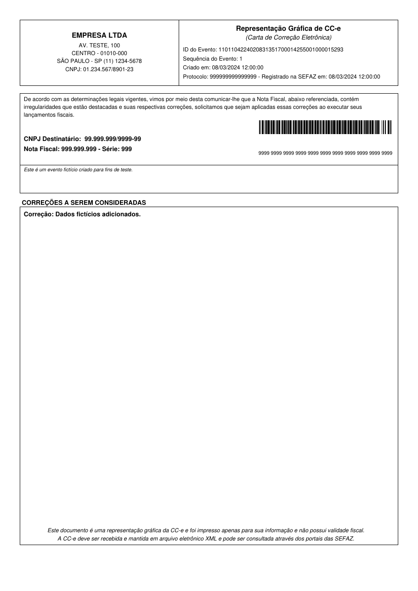

DACCe (Documento Auxiliar da Carta de Correção Eletrônica) é uma representação impressa da CC-e (Carta de Correção Eletrônica) usada no Brasil. Fornece detalhes sobre correções feitas em uma NF-e (Nota Fiscal Eletrônica) emitida anteriormente, incluindo o texto de correção, a chave da nota referenciada e informações do protocolo.

{ width="480" }

## Uso Básico

=== "Python"

    ```python
    from brazilfiscalreport.dacce import DaCCe

    # Caminho para o arquivo XML
    xml_file_path = 'cce.xml'

    # Carregar conteúdo do XML
    with open(xml_file_path, "r", encoding="utf8") as file:
        xml_content = file.read()

    # Instanciar o objeto PDF da CC-e com o conteúdo XML carregado
    cce = DaCCe(xml=xml_content)

    # Salvar o PDF gerado em um arquivo
    cce.output('cce.pdf')
    ```

=== "CLI"

    ```bash
    bfrep dacce /path/to/cce.xml
    ```

    !!! note
        O comando `dacce` lê os dados do emitente da seção `ISSUER` de um `config.yaml` no diretório de trabalho — veja a [documentação do CLI](cli.md). Sem ele, dados fictícios de emitente são impressos no PDF. Adicionar logo via CLI não é suportado para o DACCe; use a API Python.

## Notas sobre a saída

- O CNPJ ou CPF do emitente vem do próprio XML (o autor do evento, em `infEvento`); os demais dados do emitente vêm do parâmetro `emitente`.
- O destinatário é impresso como **CNPJ** (`CNPJDest`) ou, no caso de pessoa física, como **CPF** (`CPFDest`). Sem nenhum dos dois, a linha é omitida.
- A marca d'água **SEM VALOR FISCAL**, como no DANFE, é aplicada a eventos de homologação (`tpAmb` = 2) e a eventos que a SEFAZ não registrou (sem `retEvento`, sem `nProt` ou com `cStat` diferente de 135/136). Nesse caso, o lugar do protocolo informa que o evento não foi registrado.
- As quebras de linha do texto da correção são mantidas, inclusive `\n` enviado como barra invertida literal seguida de `n`. Quando o texto não cabe no quadro, a fonte é reduzida; se ainda assim não couber, o texto é cortado com reticências.

## Personalizando o DACCe 🎨

A classe `DaCCe` aceita os seguintes parâmetros:

### Parâmetros

---

**xml**

- **Tipo**: `str`
- **Descrição**: O conteúdo XML do evento CC-e.
- **Obrigatório**: Sim.

---

**emitente**

- **Tipo**: `dict` ou `None`
- **Descrição**: Um dicionário contendo as informações do emitente, exibidas no cabeçalho do DACCe. O XML da CC-e não traz esses dados, apenas o CNPJ/CPF do emitente, que é impresso mesmo sem o dicionário. Todas as chaves são opcionais: as ausentes ou vazias são omitidas.
- **Chaves**: `nome`, `end`, `bairro`, `cep`, `cidade`, `uf`, `fone` e `ie`.
- **Exemplo**:
    ```python
    emitente = {
        "nome": "EMPRESA LTDA",
        "end": "AV. TEST, 100",
        "bairro": "CENTRO",
        "cep": "01010-000",
        "cidade": "SÃO PAULO",
        "uf": "SP",
        "fone": "(11) 1234-5678",
        "ie": "123456789012",
    }
    ```
- **Padrão**: `None` (apenas o CNPJ/CPF do XML é exibido no quadro do emitente).

---

**image**

- **Tipo**: `str`, `BytesIO`, `bytes` ou `None`
- **Descrição**: Caminho para um arquivo de imagem do logo ou dados binários da imagem a ser exibida no cabeçalho junto com as informações do emitente. O valor é repassado diretamente ao [fpdf2](https://github.com/py-pdf/fpdf2), então URLs e instâncias de `PIL.Image.Image` também são aceitos.
- **Exemplo**:
    ```python
    image = "path/to/logo.jpg"
    ```
- **Padrão**: `None` (sem logo).

---

### Exemplo de Uso com Personalização

```python
from brazilfiscalreport.dacce import DaCCe

# Caminho para o arquivo XML
xml_file_path = 'cce.xml'

# Carregar conteúdo do XML
with open(xml_file_path, "r", encoding="utf8") as file:
    xml_content = file.read()

# Informações do emitente
emitente = {
    "nome": "EMPRESA LTDA",
    "end": "AV. TEST, 100",
    "bairro": "CENTRO",
    "cidade": "SÃO PAULO",
    "uf": "SP",
    "fone": "(11) 1234-5678",
}

# Instanciar com emitente e logo
cce = DaCCe(xml=xml_content, emitente=emitente, image="path/to/logo.png")

# Salvar o PDF gerado em um arquivo
cce.output('cce.pdf')
```
