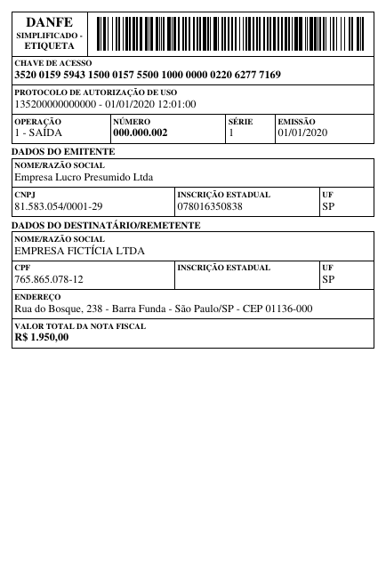

O DANFE Simplificado – Etiqueta é um DANFE reduzido, impresso em etiqueta, usado principalmente no envio de pedidos do comércio eletrônico. Segue a Nota Técnica **NT 2020.004 v1.10** e o item 3.12 do *Manual de Especificações Técnicas do DANFE* (MOC 7.0, Anexo II). A NF-e é a mesma do DANFE comum, com `tpImp=3` (DANFE Simplificado).

{ width="320" }

## Uso Básico

=== "Python"

    ```python
    from brazilfiscalreport.danfe import DanfeEtiqueta

    with open("nfe.xml", "r", encoding="utf8") as file:
        xml_content = file.read()

    etiqueta = DanfeEtiqueta(xml=xml_content)
    etiqueta.output("etiqueta.pdf")
    ```

=== "CLI"

    ```bash
    bfrep danfe-etiqueta /caminho/para/nfe.xml
    ```

## Personalizando a etiqueta

As opções ficam na classe `DanfeEtiquetaConfig`:

```python
from brazilfiscalreport.danfe import DanfeEtiqueta, DanfeEtiquetaConfig

config = DanfeEtiquetaConfig(
    paper_width=100,
    paper_height=150,
    display_items=True,
)
etiqueta = DanfeEtiqueta(xml=xml_content, config=config)
```

| Opção | Padrão | Descrição |
|---|---|---|
| `paper_width`, `paper_height` | `100`, `150` | Tamanho da etiqueta em mm. A etiqueta térmica de 10 x 15 cm é a usual nos envios; a NT só exige largura mínima de **55 mm**. |
| `margins` | `Margins(3, 3, 3, 3)` | Margens em mm. |
| `font_type` | `FontType.TIMES` | `TIMES` ou `COURIER`. |
| `display_total` | `True` | Imprime o valor total da NF-e (`vNF`), opcional desde a NT 2020.004 v1.10. |
| `display_delivery_address` | `True` | Imprime o endereço do destinatário, ou o do grupo `entrega` (com o recebedor) quando a NF-e o tem. |
| `display_items` | `False` | Lista os itens (código, descrição e quantidade). Os que não cabem são contados numa última linha, "E MAIS N ITEM(NS) NÃO LISTADO(S)". |
| `watermark_cancelled` | `False` | Imprime a marca d'água "CANCELADA". |
| `epec_protocol` | `""` | Protocolo do evento EPEC (número e data/hora), impresso enquanto a NF-e emitida em contingência EPEC não tem autorização. Vem no retorno do evento, não no XML da NF-e. |

## Notas sobre o leiaute

- A etiqueta imprime os campos exigidos pela NT: a descrição "DANFE Simplificado – Etiqueta", a chave de acesso com o código de barras e o protocolo de autorização; o nome, a UF, o CNPJ e a inscrição estadual do emitente; o tipo de operação (entrada/saída), o número, a série e a data de emissão; e o nome, a UF, o CNPJ/CPF e a IE do destinatário, quando houver.
- O código de barras fica no canto superior direito. O módulo tem 0,25 mm, 2 pontos das impressoras térmicas de 203 dpi usadas em etiquetas, e o código fica com cerca de 74 mm. Em papel estreito demais para isso o módulo diminui e, abaixo dos 6 cm do MOC, é emitido um aviso: o código pode não ser lido numa impressora de 203 dpi.
- Com menos de 70 mm de largura útil (papel abaixo de 76 mm), cada campo ocupa uma linha.
- Em homologação, ou sem o protocolo de autorização, a etiqueta sai com a marca d'água "SEM VALOR FISCAL". Na contingência EPEC, imprime também a data de início e o motivo da contingência (`dhCont` e `xJust`).
- O DANFE Simplificado comum (venda fora do estabelecimento, com itens) e o DANFE Simplificado Tipo 2 (`tpImp=6`) são outros documentos e não são cobertos aqui.
